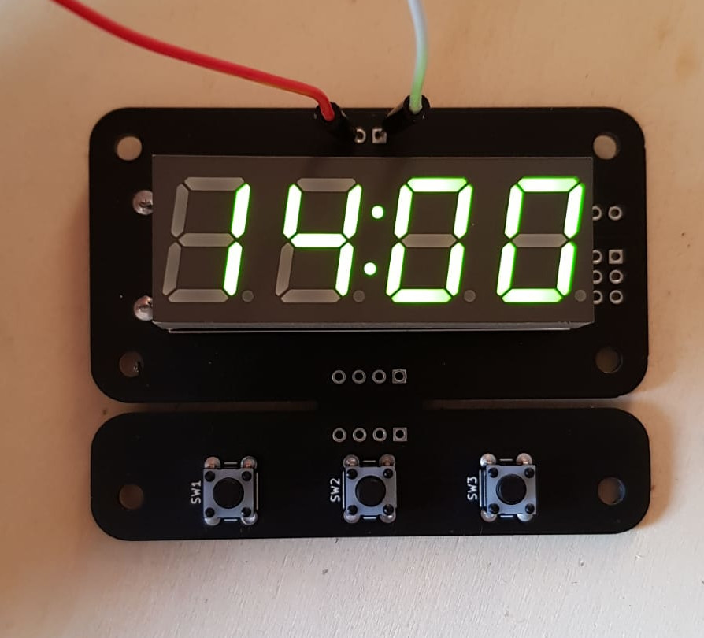

# Clock
A digital clock based on the AtTiny85 and DS3231 chips.

### Features:
 * Simple interface, designed for the elderly who just need a simple clock.
 * Time is kept even after a power loss, provided the battery is working.
 * Great time keeping accuracy, thanks to the 2ppm accuracy of the DS3231 chip (basically in the worse case it will gain/lose 1 minute every year).
 * Brightness can be adjusted, the value is saved and will be restored even after a complete power loss.
 * Can display ambient temperature (the value is updated internally every minute or so).
 * Easy to build PCB, ideal for beginners.
 * Cheap, around $10.
 * The display consumes most of the power, so in theory it's possible to run the clock on batteries [not tested]. 
 * Fully open source.

## PCB Design
Things to note:
- The board is symmetrical to simplify the design of mounting mechanisms.
- The button panel is "removable" from the main pcb body, to allow repositioning of the buttons.
- On the board are present two jumpers that disconnect the ATTiny from the I2C bus, for debug purposes.

## 3D printed case
TBD

## Building and Flashing the firmware

You will need a working avr toolchain, with `avr-gcc` and `avrdude` installed on your computer. They are very easy to install on a linux computer, but on windows you will have to fiddle with Arduino IDE.
You will also need an AVR programmer, or alternatively you can use "Arduino as ISP". 
You may need to modify the makefile and replace /dev/ttyACM0 with the usb port where your ICSP programmer is connected.

Once the programmer is connected to the board simply run  
``` 
make install 
```

# Gallery
<p align="center">
  
</p>

<p align="center">
  
</p>

<p align="center">
  
</p>

# Revisions
- rev-1: initial design
- rev-2: fix display was upside down, despite silkscreen being right side up